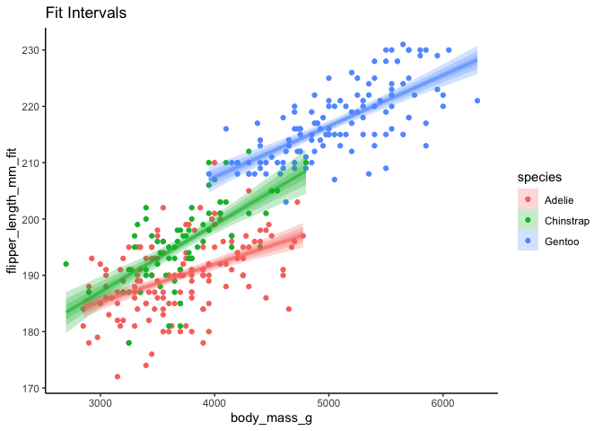
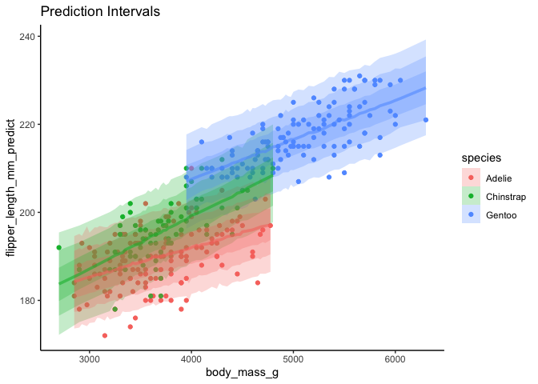

<!-- README.md is generated from README.Rmd. Please edit that file -->

# sinterval

<!-- badges: start -->

[](https://www.tidyverse.org/lifecycle/#experimental)
[](https://CRAN.R-project.org/package=sinterval)
<!-- badges: end -->

The goal of sinterval is to use simulation from fit models to get
distributions of responses given fit, prediction, or other intervals.
This is similar to getting posterior predictions and fits from a
Bayesian model, but for models fit using likelihood, least squares, or
other techniques.

## Installation

You can install sinterval from github with:

``` r
remotes::install_github("jebyrnes/sinterval")
```

You can install the released version of sinterval from
[CRAN](https://CRAN.R-project.org) once it is up with:

``` r
install.packages("sinterval")
```

## Example

Here is a basic example using [ggdist](https://mjskay.github.io/ggdist/)
for visualization.

``` r
library(sinterval)
library(palmerpenguins)
library(ggplot2)
library(ggdist)


mod <- lm(flipper_length_mm ~ body_mass_g*species,
          data = penguins)

fit_sims <- add_fitted_sims(penguins, mod)
predicted_sims <- add_predicted_sims(penguins, mod)

ggplot(fit_sims,
       aes(x = body_mass_g, 
           y = flipper_length_mm_fit, 
          color = species, fill = species)) +
  geom_point(data = penguins, aes(y = flipper_length_mm)) +
  stat_lineribbon(alpha = 1/4) +
  theme_classic() +
  labs(title = "Fit Intervals")
```



``` r

ggplot(predicted_sims,
       aes(x = body_mass_g, 
           y = flipper_length_mm_predict, 
          color = species, fill = species)) +
  geom_point(data = penguins, aes(y = flipper_length_mm)) +
  stat_lineribbon(alpha = 1/4) +
  theme_classic() +
  labs(title = "Prediction Intervals")
```


